# AI Product hack AGI in 2024 документация

## Варианты использования

- ВАЖНО:
    - Для использования решения локально необходимо иметь VPN.
    - Для работы решения нужны следующие апи ключи:
        - open ai api https://platform.openai.com/account/api-keys
        - tavily https://app.tavily.com/sign-in
    - Необходимо убрать галочку с режима тестирования.
- Для тестирования решения в рамках хакатона AI Product вы можете получить api ключи у
    - https://t.me/DukhaninDY
    - https://t.me/semyondipner
    - либо же воспользоваться демо (не требуются api ключи и vpn) - (тут вписать наше демо)

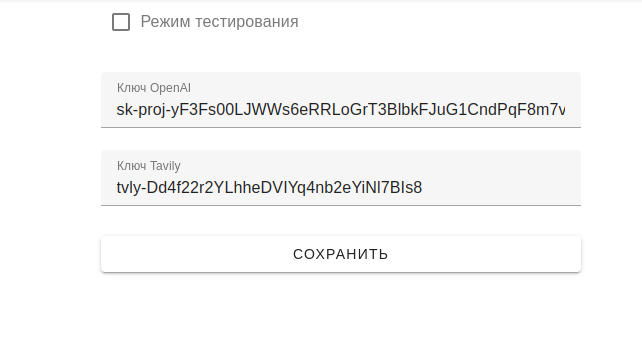

## Установка решения локально

- Демо доступно по ссылке - [Ссылка](https://158.160.165.233/ui/emails)

Клонируем репозиторий:

```bash
git clone https://github.com/semyondipner/AI-Product-Hack.git
cd AI-Product-Hack
```

Запуск докера:

```bash
./bin/prod-run.sh
```
- Откройте [https://localhost/ui/](https://localhost/ui/report/7) в браузере.
- Загрузите примеры в базу данных.

```bash
curl --request POST --url https://localhost/api/v1/generic/load-samples -k
```

Очистить базу данных:
```bash
curl --request POST --url https://lct2419.open-core.ru/api/v1/generic/load-samples -k
```

## Dev

Запуск локально

```bash
docker compose up -d --build
```

Открыть в браузере: `https://localhost/ui/`

### NestJS CLI

In `services/backend` directory:

```bash
npx nest
```

### TMP Files
- services/backend/src/generic/samples.ts
- services/researcher/app/samples/research.md

# Использование интерфейса 

- Перейдите на вкладку источники

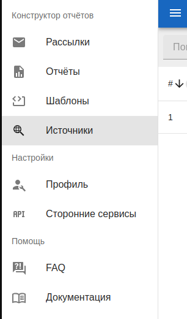

- Нажмите кнопку создать чтобы добавить источники (они будут использованы для создания сводки новостей/составления отчетов). Можете удалить/изменить существующие ссылки

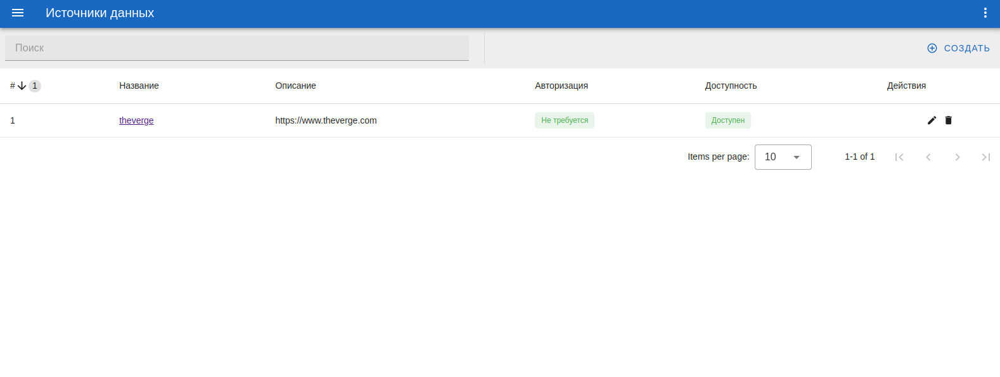

- Перейдите в шаблоны чтобы создать шаблон отчета (это необязательный шаг, но он упростит создание похожих сводок новостей и отчетов в дальнейшем). Эти шаблоны нам дальше пригодятся чтобы создать сводку новостей или отчет.

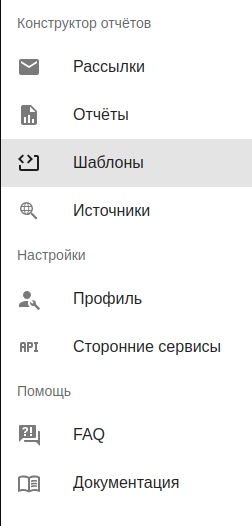

- Тут можно искать, редактировать, удалять и создавать шаблоны

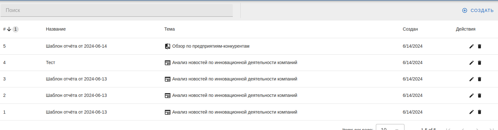

- При создании шаблонов вы можете выбрать одну из предзаготовленных тематик. Сейчас поддерживается 5 тематик, внутри которых можно настроить свои параметры:
    - Анализ новостей по инновационной деятельности компаний (Предоставляет сводку новостей, релевантных для конкретной компании и сторудника)
    - Анализ рынка
    - Обзор по предприятиям-конкурентам
    - Сравнение продуктов и услуг
    - Сравнение технологий

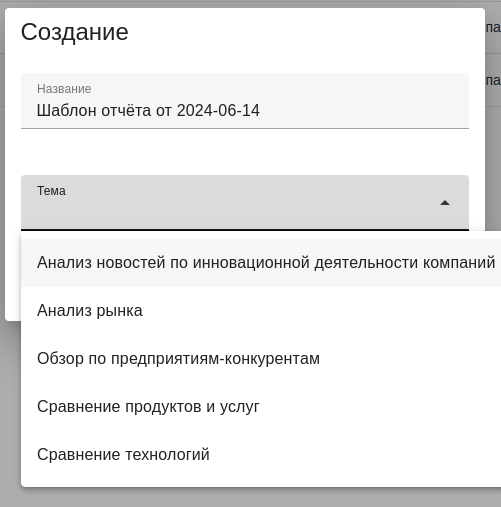

Анализ новостей по инновационной деятельности компаний

- Пример параметров для сводки новостей:

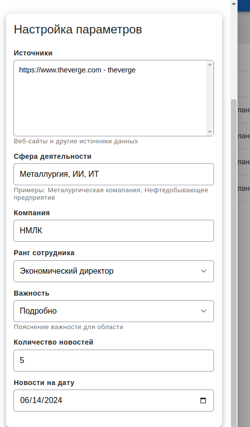

- Отчеты

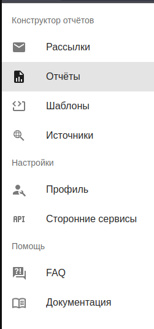

- Тут мы и будем получать нашу сводку новостей или отчет. Можно искать, добавлять, удалять и редактировать

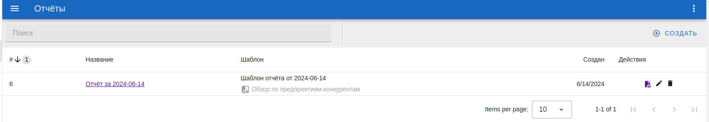

- Для создания отчета вам будет предложен выбрать один из ранее созданных шаблонов

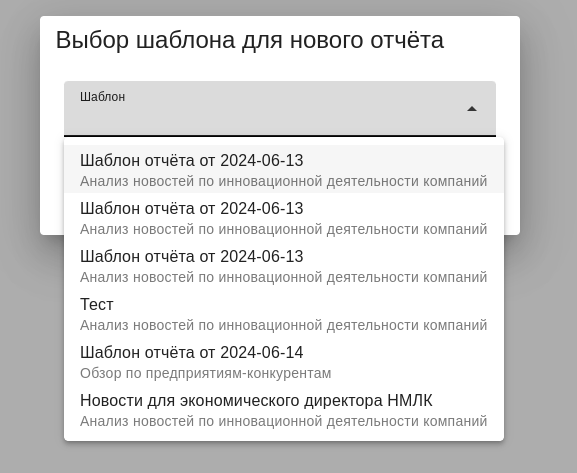

- Для удобства вам нужно будет сверить параметры отчета и скорректировать их при желании.

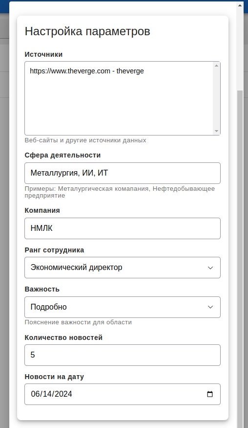

- Мы выбрали параметры для отчета, теперь осталось только выбрать его

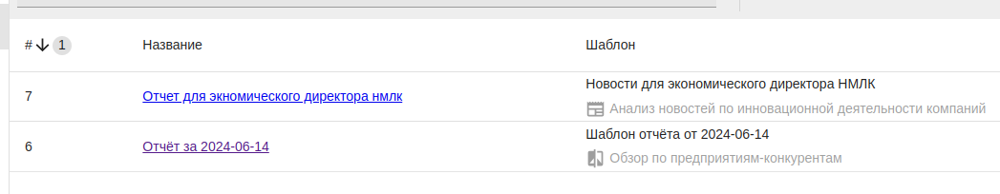

- И сгенерировать

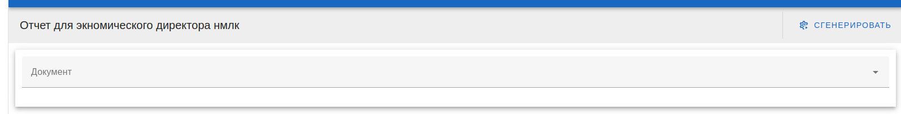

- Пример выдачи сводки новостей:

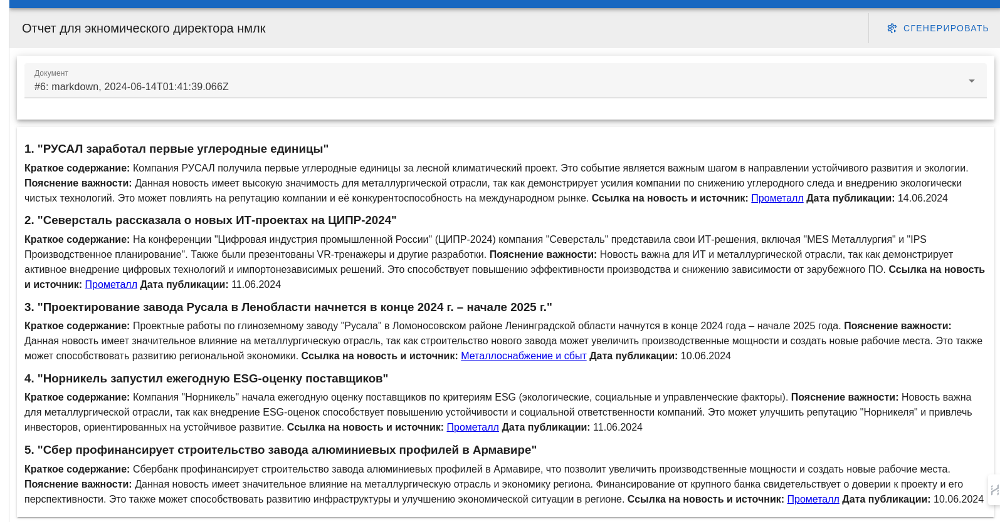
